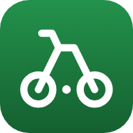

# Publix Bike Commuter

Bicycle routes, travel times and turn-by-turn directions from **Club Cortile
Circle, Kissimmee FL** to every Publix within **30 miles** — 111 stores — as an
offline-capable web app you can install on an Android phone.

Routes prefer the sidewalk network over the trunk highways, which is both legal
here and a great deal safer. See [Why sidewalks](#why-sidewalks) below.



## What it does

- **Map of all 111 stores** within 30 miles, each pin labelled with its real
  Publix store number (home store **#1607 Sunrise City Plaza** picked out in
  red).
- **Tap a store → the route draws itself**, with distance, ride time and an
  arrival clock time.
- **Two routes per store.** *Balanced* is the sensible everyday line;
  *Avoid traffic* leans harder on sidewalks and paths, and will detour to stay
  off fast roads.
- **"What you're riding on."** Every route is broken down by road class —
  bike path, residential, arterial, trunk highway — with the mileage and
  whether there's a bike lane. This is Florida; a five-minute saving that puts
  you on US‑192 with no shoulder is not a saving.
- **Pace slider.** Times re-scale to how fast *you* actually ride.
- **Turn-by-turn directions** with real street names.
- **Navigate mode** follows your GPS, counts down to the next turn, and
  re-routes if you come off the line.
- **Hand off to Google Maps** at any point, passing waypoints from the planned
  route so Google follows roughly the same path.
- **Works with no signal.** All district routes, directions and store details
  are baked in; map tiles cache as you view them.

## Install it on your phone

The app is a PWA, so it installs from the browser — no Play Store, no sideloading.

1. Push to `main` (or run the **Deploy to GitHub Pages** workflow by hand from
   the Actions tab). It turns Pages on for the repo itself and publishes; the
   run's summary shows the published URL.
2. Open that URL in **Chrome on your Android phone**.
3. Menu (⋮) → **Add to Home screen** / **Install app**.

If the deploy fails with **`Create Pages site failed. Error: Resource not
accessible by integration`**, the workflow could not switch Pages on by itself:
a workflow's `GITHUB_TOKEN` is allowed to publish to Pages but not to create the
Pages site, which needs repository-admin rights. Set it once by hand under
**Settings → Pages → Source: GitHub Actions**, then re-run the workflow from the
Actions tab. Once the site exists, `enablement: true` simply finds it and every
later push deploys on its own.

It then launches full-screen with its own icon, keeps working offline, and can
use GPS for navigation.

> Location and install both require HTTPS. GitHub Pages provides it; opening
> `index.html` off the filesystem will not work.

### Want a real APK?

Point [PWABuilder](https://www.pwabuilder.com/) at the published URL, or run
[Bubblewrap](https://github.com/GoogleChromeLabs/bubblewrap), to wrap this
manifest into a signed Android package. Nothing in the app needs to change.

## Run it locally

```bash
python3 -m http.server 8000
# then open http://localhost:8000
```

A plain static server is all it needs — there is no build step.

## Where the data comes from

| Data | Source |
|---|---|
| Store numbers, names, addresses, hours, phone | Publix's own store locator (`services.publix.com`) — the same directory publix.com uses |
| Store building positions | OpenStreetMap |
| Roads, bike lanes, surfaces | OpenStreetMap |
| Bicycle routing and durations | [BRouter](https://brouter.de), cycling profiles over OSM data |
| Map tiles | OpenStreetMap standard tiles |

Store data © Publix Super Markets. Map data © OpenStreetMap contributors, ODbL.

## Regenerating the data

```bash
python3 tools/make_profiles.py    # regenerate routing profiles -> tools/profiles/
python3 tools/fetch_stores.py     # refresh the store list  -> data/stores.json
python3 tools/build_routes.py     # recompute every route   -> data/routes*
python3 tools/make_chart.py       # rebuild the time chart  -> docs/ROUTES.md
python3 tools/make_artifact.py    # rebuild the standalone map
```

`build_routes.py --resume` continues an interrupted run. Street names for turn
directions come from a local Overpass cache; `--fetch-names` looks up more, but
Overpass is often too busy to serve an area this size, and a turn with no name
still routes correctly — it just doesn't say what it turns onto.

### How the route data is laid out

111 stores of geometry is too much to load at once on a phone, so it is split:

| File | Holds | When it loads |
|---|---|---|
| `data/stores.json` | every store's identity and position | at boot |
| `data/routes-index.json` | distance, duration and road mix per store | at boot |
| `data/routes/<store>.json` | that store's geometry and turn list | when you open the store |

The service worker precaches the first two and keeps each route file after its
first view, so a store you have opened stays available with no signal.

`tools/make_icons.mjs` regenerates the app icons (needs `npm i playwright`).

### Changing the home address or the radius

Both live at the top of `tools/fetch_stores.py`:

```python
START = (28.328194, -81.464348)   # Club Cortile Circle
DISTRICT_RADIUS_KM = 48.28        # 30 miles
MAP_RADIUS_KM = 48.28
```

Change them, re-run the scripts above, and the app picks it up.

## Why sidewalks

BRouter's stock cycling profiles encode German and EU road law, under which
riding on a footway is forbidden unless it is signed for bicycles. In
`trekking.brf` that is one line:

```
else if vehicle= then ( if highway=footway then false else defaultaccess )
```

Any `highway=footway` with no explicit `bicycle=` tag is access-denied. Around
Kissimmee that rules out almost the entire sidewalk network — of 8,700+ mapped
footways in the core area, 3,400+ tagged `footway=sidewalk`, only about 170
carry any bicycle tag at all. The router's answer was to put the rider on
US-192.

Florida law runs the other way: **§316.2065(9)–(11) permits riding on sidewalks**
unless a local ordinance forbids it, with the rider taking on the rights and
duties of a pedestrian. `tools/make_profiles.py` generates two profiles that
encode that, and re-price the fast roads to match how they actually ride.

The difference is not subtle. Store **#1431 Water Tower Shoppes**, same distance
and the same 24 minutes either way:

| | Trunk highway | Sidewalk |
|---|---|---|
| stock `trekking` | 3.61 mi (69%) | 0 |
| `florida-balanced` | **0** | 4.54 mi (87%) |

Ways tagged `bicycle=no` are still refused, so genuine local bans are respected.

Sidewalks are not free of risk — they trade exposure to fast traffic for
conflicts at driveways and intersections — so they are rated *good* rather than
*best* in the road mix, below a quiet residential street or a proper bike path.

## About the store set

Publix's internal district rosters aren't published anywhere I can read, so
**the store set here is geographic, not official**: every Publix within 30 miles
straight-line of Club Cortile Circle, which comes to 111 stores reaching
Orlando, Winter Haven, Clermont, Oviedo and Lake Mary.

To change it, edit `tools/fetch_stores.py`, or build a hand-picked set:

```bash
python3 tools/build_routes.py --refs 1607 1431 812 1194 707
```

## The travel times

Durations come from BRouter's cycling model, which already accounts for turns,
surfaces and gradient, then get re-scaled to the pace you pick in the app
(default 10 mph / 16 km/h). They **exclude** long waits at signalised
intersections — on routes that cross US‑192 or John Young Parkway, add a couple
of minutes.

Full chart of every store: **[docs/ROUTES.md](docs/ROUTES.md)**.

## The standalone map

`docs/district-map.html` is a single self-contained file — the same stores,
routes, times and directions, drawn on a vector map built from the real road
network. It has no tile server and no routing API behind it, so it opens from a
phone, a USB stick or an email attachment and keeps working with no connection
at all. Open it in any browser; nothing to install.

## Ride safe

Most routes now stay off the trunk highways entirely, but not all of them can —
some corridors have no sidewalk and no alternative. The app flags every such
stretch and says whether a bike lane is mapped there. Check the "What you're
riding on" panel before committing to a route you haven't ridden.

Sidewalk riding has its own hazards: drivers pulling out of driveways and
turning at intersections often aren't looking for someone moving at bike speed
on the footpath. Slow down at crossings.
